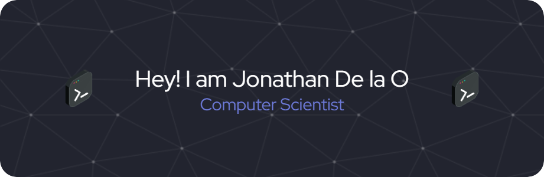

### Hi, I'm Jonathan De la O, a Computer Science professional and former student-athlete. I am passionate about Artificial Intelligence, Machine Learning, Data Science, and Business Intelligence. I thrive on solving complex problems, leveraging data-driven insights, and developing innovative solutions that bridge technology and business.

### Through personal projects and internships, I've gained hands-on experience in diverse aspects of development, showcased in my portfolio at https://jonathandelao10.github.io/JD_Portfolio/

### As a former student-athlete, I bring discipline, adaptability, and a team-driven mindset to every challenge. Passionate about innovation and continuous learning, I am eager to contribute to impactful projects at the intersection of technology, user needs, and business strategy.
