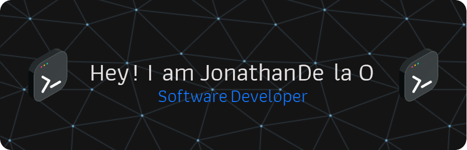

### I am a software developer that enjoys connecting the dots, be it ideas from different disciplines, people from different teams, or applications from different industries. I have strong technical skills and an academic background in databases and different programming languages such as Java, C++, and Python.

### My passion lies in solving problems with tailored data and communicating complex ideas to non-technical stakeholders. I am able to jump across verticals to deliver high-performing development solutions. I love learning new things and I am always looking to challenge myself.
